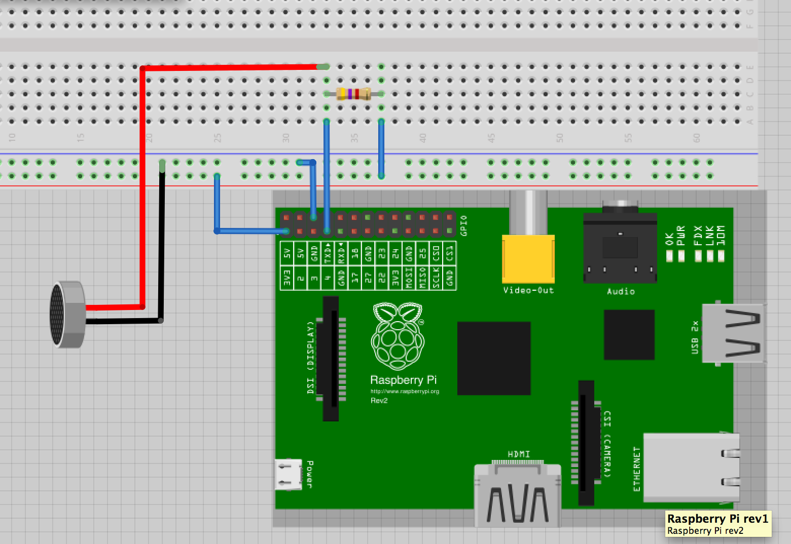

iButton - DS1990R-F5 
=======

Run a iButton ( DS1990R-F5 ) on Raspberry PI with Debian

http://www.maximintegrated.com/datasheet/index.mvp/id/4787

Activate gpio and one wire bus driver
------

    modprobe w1-gpio
    modprobe w1-smem
    
    
Permisions
-----
To run the script not at root you hast du set write permitions.

    chmod a+w /sys/devices/w1_bus_master1/w1_master_slaves
    chmod a+w /sys/devices/w1_bus_master1/w1_master_remove
    chmod a+w /sys/devices/w1_bus_master1/w1_master_search
    

Connect Raspberry Pi With iButtonreader
-----

